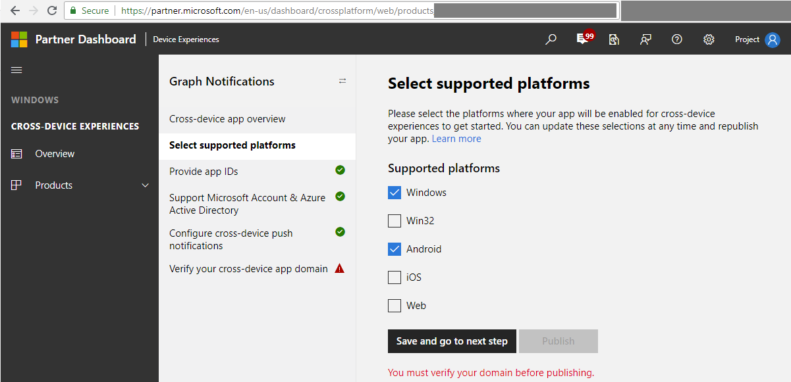
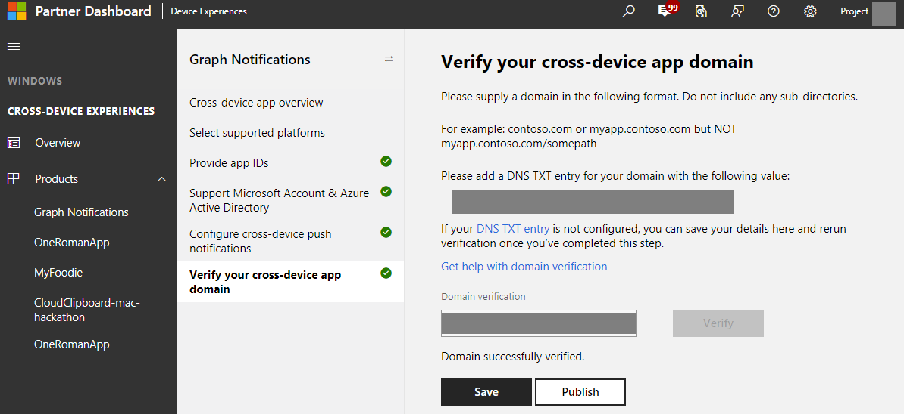

## Preliminary setup for push notifications

### Register your app for push notifications

Register your application with Apple for [Apple Push Notification](https://developer.apple.com/notifications/) support. Be sure to make note of the sender ID and server key that you receive; you'll need them later. 

Once registered, you must associate push notification functionality with the Connected Devices Platform in your app.

```ObjectiveC
self.notificationRegistration = [[MCDConnectedDevicesNotificationRegistration alloc] init];
    if ([[UIApplication sharedApplication] isRegisteredForRemoteNotifications])
    {
        self.notificationRegistration.type = MCDNotificationTypeAPN;
    }
    else
    {
        self.notificationRegistration.type = MCDNotificationTypePolling;
    }
    self.notificationRegistration.appId = [[NSBundle mainBundle] bundleIdentifier];
    self.notificationRegistration.appDisplayName = (NSString*)[[NSBundle mainBundle] objectForInfoDictionaryKey:@"CFBundleDisplayName"];
    self.notificationRegistration.token = deviceToken;
    self.isRegisteredWithToken = YES;
```

### Register your app in Microsoft Windows Dev Center for cross-device experiences
If you require communication to your iOS device, you'll need to register with the Microsoft Windows Dev Center.  Next, you need to register your app for the [cross-device experiences feature of the Microsoft Developer Dashboard](https://developer.microsoft.com/dashboard/crossplatform/web). This is a different procedure from MSA and AAD app registration above. The main goal for this process is to map the platform specific app identities with a cross-platform app identity that is recognized by Connected Devices Platform, and at the same time authorizes the Platform to send notifications using the native push notification services corresponding to each mobile platform. In this case, it enables communication to iOS app endpoints via APNs – Apple Push Notification Service. 
Go to Dev Center Dashboard, navigate to Cross-Device Experiences from the left side navigation pane, and select configuring a new cross-device app.


The Dev Center on-boarding process require the following steps:
* Select supported platforms – select the platforms where your app will have a presence and be enabled for cross-device experiences. You can select from Windows, Android, and/or iOS.


* Provide app IDs – provide app IDs for each of the platform where your app has a presence.

> [!NOTE]
> You may add different IDs (up to ten) per platform – this is in case you have multiple version of the same app, or even different apps, that want to be able to receive the same notifications sent by your app server targeted at the same user. 
> [!TIP] 
> For iOS apps, this is the Package Name you assigned to your app when you created the project. 

* Provide or select the app IDs from MSA and/or AAD app registrations. These client IDs corresponding to MSA or AAD app registration were obtained in the previous MSA/AAD app registration steps from above.

* Connected Devices Platform capabilities leverages each of the native notification platforms on major platforms to send notifications down to the app client endpoints, namely, WNS (for Windows UWP), GCM (for Android) and APNs (for iOS). Provide your credentials for these notification platforms to enable the Platform to deliver the notifications for your app server, when you publish user-targeted notifications. 

> [!NOTE] 
> For iOS, enabling APNs is a prerequisite to communication to an iOS device. See [APNs Overview](https://developer.apple.com/library/archive/documentation/NetworkingInternet/Conceptual/RemoteNotificationsPG/APNSOverview.html#//apple_ref/doc/uid/TP40008194-CH8-SW1) for more details. Once you complete the onboarding, you can then provide the push credentials via Windows Dev Center to the Connected Device Platform. 
* The last step is to verify your cross-device app domain, which serves as a verification process to prove that your app has the ownership of this domain which acts like a cross-device app identity for the app you registered.


### Process notifications as they are received by the app

Once the Cross-Device experience within the Microsoft Windows Dev Center has been validated, make sure your app can process the notifications as they come in. 

```ObjectiveC
`MCDConnectedDevicesProcessNotificationOperation* processOperation = [_platformManager.platform processNotification:notificationInfo];`
```